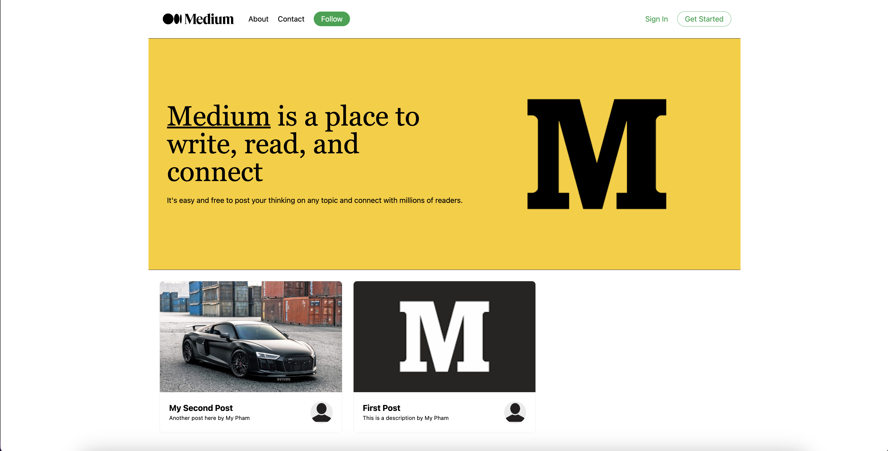
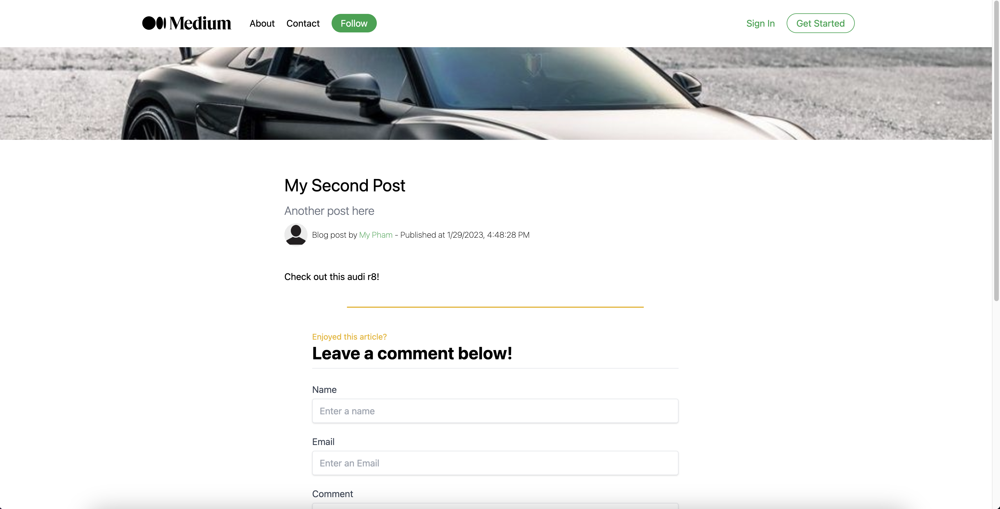

# Medium Clone - ReactJS

## 📷 Screenshot

  
  

## 📝 Project Description

The Medium Clone project allows users to view and post onto the blog to sanity.io.

## 📚 Technologies

- [ReactJS](https://reactjs.org/)
- [Next.js](https://nextjs.org/)
- [Tailwind CSS](https://tailwindcss.com/)
- [Vercel](https://vercel.com/dashboard)
- [Sanity.io](https://www.sanity.io/)
